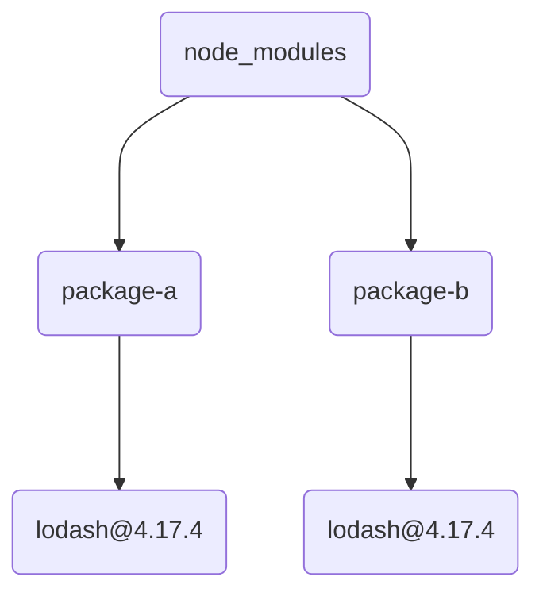
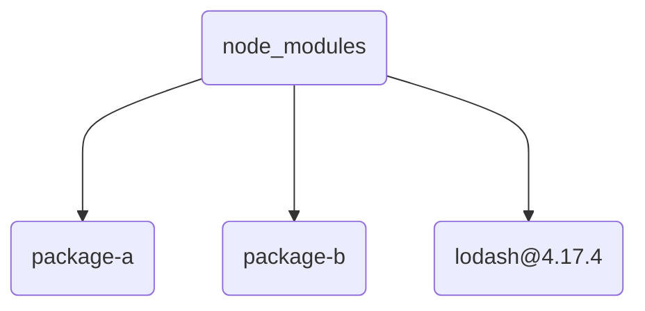
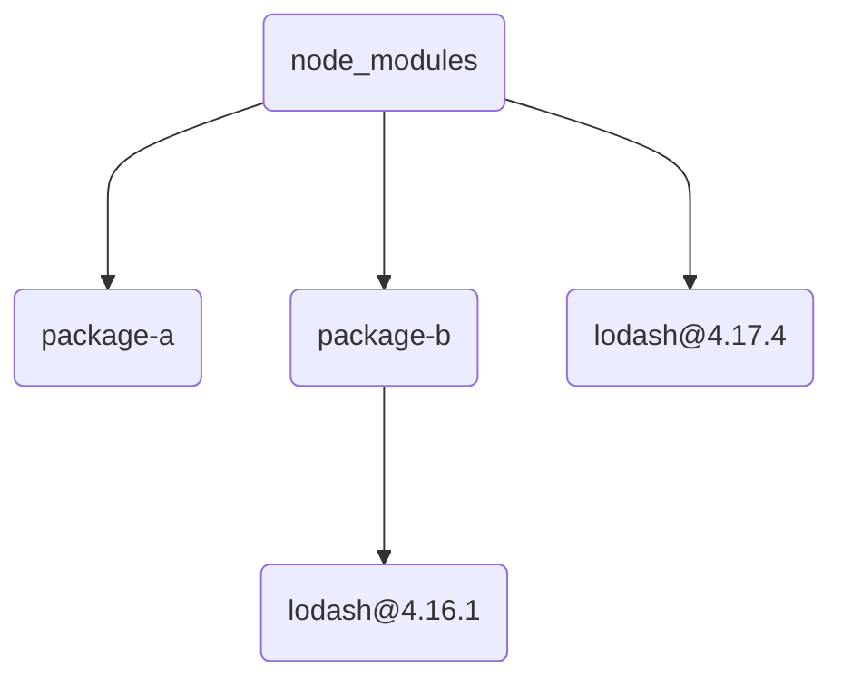
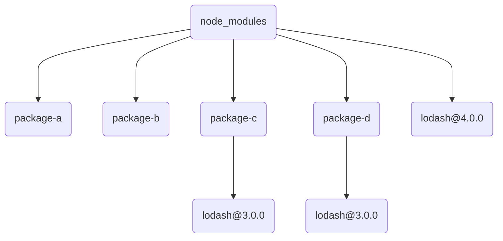

# 请描述 node_modules 的目录结构(拓扑结构)

::: tip Issue
欢迎在 Gtihub Issue 中回答或反馈问题: [Issue 746](https://github.com/shfshanyue/Daily-Question/issues/746)
:::

> 以下 mermaid 无法渲染，可移至 <https://juejin.cn/post/7030084290989948935>

## 基础

当 `require('package-hello')` 时，假设 `package-hello` 是一个 npm 库，我们是如何找到该 `package` 的？

1. 寻找当前目录的 `node_modules/package-hello` 目录
1. 如果未找到，寻找上一级的 `../node_modules/package-hello` 目录，以此递归查找

## 很久以前: 嵌套结构

在 `npmv2` 时，`node_modules` 对于各个 package 的拓扑为嵌套结构。

假设:

1. 项目依赖 `package-a` 与 `package-b` 两个 package
1. `package-a` 与 `package-b` 均依赖 `lodash@4.17.4`

依赖关系以 Markdown 列表表示:

```markdown
- package-a
  - `lodash@4.17.4`
- package-b
  - `lodash@4.17.4`
```

此时 `node_modules` 目录结构如下:



此时最大的问题

1. 嵌套过深
2. 占用空间过大

## 现在阶段: 平铺结构

> 目前在 npm/yarn 中仍然为平铺结构，但 pnpm 使用了更省空间的方法，以后将会提到

在 `npmv3` 之后 `node_modules` 为平铺结构，拓扑结构如下:



### _一个问题: 以下依赖最终 node_modules 结果如何？_

> 可参考[该示例](https://github.com/shfshanyue/node-examples/tree/master/engineering/package/topology)

依赖关系以 Markdown 列表表示

```markdown
- package-a
  - `lodash@^4.17.4`
- package-b
  - `lodash@^4.16.1`
```

答: 与上拓扑结构一致，因为二者为 `^` 版本号，他们均会下载匹配该版本号范围的最新版本，比如 `@4.17.4`，因此二者依赖一致。

> 此时如果有 lock，会有一点小问题，待稍后讨论

node_modules 目录结构如下图：


### _再一个问题: 以下依赖最终 node_modules 结果如何？_

> 可参考[该示例](https://github.com/shfshanyue/node-examples/tree/master/engineering/package/topology-dup)

```markdown
- package-a
  - `lodash@4.17.4`
- package-b
  - `lodash@4.16.1`
```

答：package-b 先从自身 node_modules 下寻找 `lodash`，找到 `lodash@4.16.1`

node_modules 目录结构如下图：



### _再一个问题: 以下依赖最终 node_modules 结果如何_

```markdown
- package-a
  - `lodash@4.0.0`
- package-b
  - `lodash@4.0.0`
- package-c
  - `lodash@3.0.0`
- package-d
  - `lodash@3.0.0`
```

答：package-d 只能从自身的 node_modules 下寻找 `lodash@3.0.0`，而无法从 package-c 下寻找，此时 **lodash@3.0.0 不可避免地会被安装两次**

node_modules 目录结构如下图:



## 重复的版本依赖有什么问题？

可参考 [npm doppelgangers](https://rushjs.io/pages/advanced/npm_doppelgangers/)

1. Install Size，安装体积变大，浪费磁盘空间
1. Build Size，构建打包体积变大，浪费带宽，网站打开延迟，破坏用户体验 (PS: 支持 Tree Shaking 会好点)
1. 破坏单例模式，破坏缓存，如 postcss 的许多插件将 postcss 扔进 dependencies，重复的版本将导致解析 AST 多次
