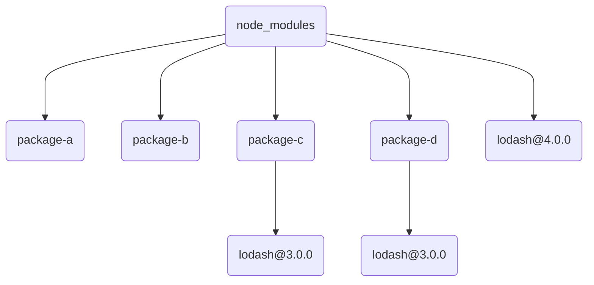

# pnpm 有什么优势

::: tip Issue
欢迎在 Gtihub Issue 中回答或反馈问题: [Issue 751](https://github.com/shfshanyue/Daily-Question/issues/751)
:::

::: tip Code
可点击此处查看[示例或实践代码](https://github.com/shfshanyue/node-examples/tree/master/engineering/package/topology-dup)
:::

::: tip 视频讲解

<iframe src="//player.bilibili.com/player.html?bvid=BV1Sb4y1t7Qr" scrolling="no" border="0" frameborder="no" framespacing="0" allowfullscreen="allowfullscreen" style="width: 100%;aspect-ratio: 4 / 3;margin: 1rem 0;"></iframe>
:::

## 软链接和硬链接

假设我们有一个文件，称为 `hello`

通过 `ln -s` 创建一个软链接，通过 `ln` 可以创建一个硬链接。

```bash
$ ln -s hello hello-soft
$ ln hello hello-hard

$ ls -lh
total 768
45459612 -rw-r--r--  2 xiange  staff   153K 11 19 17:56 hello
45459612 -rw-r--r--  2 xiange  staff   153K 11 19 17:56 hello-hard
45463415 lrwxr-xr-x  1 xiange  staff     5B 11 19 19:40 hello-soft -> hello
```

他们的区别有以下几点:

1. 软链接可理解为指向源文件的指针，它是单独的一个文件，仅仅只有几个字节，它拥有独立的 `inode`
1. 硬链接与源文件同时指向一个物理地址，它与源文件共享存储数据，它俩拥有相同的 `inode`

## pnpm 为何节省空间

它解决了 npm/yarn 平铺 node_modules 带来的依赖项重复的问题 (doppelgangers)

假设存在依赖依赖:

```bash
.
├── package-a
│   └── lodash@4.0.0
├── package-b
│   └── lodash@4.0.0
├── package-c
│   └── lodash@3.0.0
└── package-d
    └── lodash@3.0.0
```

那么不可避免地在 npm 或者 yarn 中，`lodash@3.0.0` 会被多次安装，无疑造成了空间的浪费与诸多问题。

```bash
./node_modules/lodash
./node_modules/package-a
./node_modules/package-b
./node_modules/package-c
./node_modules/package-c/node_mdoules/lodash
./node_modules/package-d
./node_modules/package-d/node_mdoules/lodash
```



这里有一个来自 [Rush](https://rushjs.io/images/home/card-doppel.svg) 的图可以很形象的说明问题。

这是一个较为常见的场景，在平时项目中有些库相同版本甚至会安装七八次，如 `postcss`、`ansi-styles`、`ansi-regex`、`braces` 等，你们可以去你们的 `yarn.lock`/`package-lock.json` 中搜索一下。

而在 pnpm 中，它改变了 npm/yarn 的目录结构，采用软链接的方式，避免了 `doppelgangers` 问题更加节省空间。

它最终生成的 `node_modules` 如下所示，从中也可以看出它解决了幽灵依赖的问题。

```bash
./node_modules/package-a       ->  .pnpm/package-a@1.0.0/node_modules/package-a
./node_modules/package-b       ->  .pnpm/package-b@1.0.0/node_modules/package-b
./node_modules/package-c       ->  .pnpm/package-c@1.0.0/node_modules/package-c
./node_modules/package-d       ->  .pnpm/package-d@1.0.0/node_modules/package-d
./node_modules/.pnpm/lodash@3.0.0
./node_modules/.pnpm/lodash@4.0.0
./node_modules/.pnpm/package-a@1.0.0
./node_modules/.pnpm/package-a@1.0.0/node_modules/package-a
./node_modules/.pnpm/package-a@1.0.0/node_modules/lodash     -> .pnpm/package-a@1.0.0/node_modules/lodash@4.0.0
./node_modules/.pnpm/package-b@1.0.0
./node_modules/.pnpm/package-b@1.0.0/node_modules/package-b
./node_modules/.pnpm/package-b@1.0.0/node_modules/lodash     -> .pnpm/package-b@1.0.0/node_modules/lodash@4.0.0
./node_modules/.pnpm/package-c@1.0.0
./node_modules/.pnpm/package-c@1.0.0/node_modules/package-c
./node_modules/.pnpm/package-c@1.0.0/node_modules/lodash     -> .pnpm/package-c@1.0.0/node_modules/lodash@3.0.0
./node_modules/.pnpm/package-d@1.0.0
./node_modules/.pnpm/package-d@1.0.0/node_modules/package-d
./node_modules/.pnpm/package-d@1.0.0/node_modules/lodash     -> .pnpm/package-d@1.0.0/node_modules/lodash@3.0.0
```

如此，依赖*软链接*的方式，可解决重复依赖安装 (doppelgangers) 的问题，**如果一个项目占用 1000 MB，那么使用 pnpm 可能仅占用 800 MB**

然而它除此之外，还有一个最大的好处，**如果一个项目占用 1000 MB，传统方式十个项目占用 10000 MB，那么使用 pnpm 可能仅占用 3000 MB**，而它得益于硬链接。

再借用以上示例，`lodash@3.0.0` 与 `lodash@4.0.0` 会生成一个指向全局目录(`~/.pnpm-store`)的硬链接，如果新项目依赖二者，则可复用存储空间。

```bash
./node_modules/.pnpm/lodash@3.0.0/node_modules/lodash   -> hardlink
./node_modules/.pnpm/lodash@4.0.0/node_modules/lodash   -> hardlink
```
