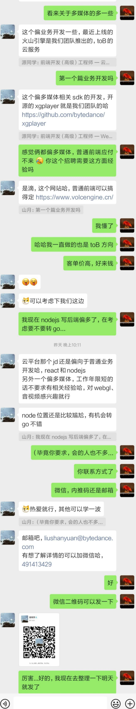

# 字节跳动-视频架构组-前端-社招

## 前端开发（高级）工程师 — 云平台方向

### 职位描述

1. 负责公司云服务产品的研发工作（PC 端、to B 方向）；
2. 参与视频相关产品的研发工作，如音视频播放器、视频质量监控平台、webRTC 等；
3. 能积极协同各个端开发公共 sdk 输出到其他业务线（js、node）；

### 职位要求

1. 计算机、通信和电子信息科学等相关专业优先；
2. 熟练掌握各种前端技术，包括 HTML/CSS/JavaScript/Node.js 等；
3. 深入了解 JavaScript 语言，使用过 React 或 Vue.js 等主流开发框架；
4. 熟悉 Node.js，了解 Express/KOA 等框架，有大型服务端程序开发经验者优先；
5. 对用户体验、交互操作及用户需求分析等有一定了解，有产品或界面设计经验者优先；
6. 有视频相关经验，如 mp4、hls、flv 知识优先；
7. 有自己的技术产品、开源作品或活跃的开源社区贡献者优先。

## 前端开发（高级）工程师 — Web多媒体

### 职位描述

1. 热爱多媒体技术如直播、AI、全景视频、WebVR等，熟悉 JavaScript 或者 Flash 播放器技术均可；
2. 负责全公司点播、直播、图片、实时通信、云游戏、多媒体工具、SDK及平台研发工作；
3. 参与多媒体技术攻坚工作，如编解码、劫持、媒体安全等；
4. 负责开源作品、技术专栏及专利、大型技术会议的设计开发及运营工作；

### 职位要求

1. 本科及以上学历，互联网履历及项目充实、扎实；
2. 熟练掌握各项前端技能：JavaScript、ES6+、CSS3、Vue、React、Webpack、Node、网络及服务；
3. 对交互体验、性能优化、线上调试、工具化有一定的实战经验；
4. 了解设计模式、理解工程化思想，对构建和持续集成有一定认识，能将复杂问题简单化；
5. 此外，我们希望你是一位有潜力和热情的工程师：

## 山月补充

当然，各大公司关于招聘的职位描述都差不多...

于是，山月与招聘同学聊了下有没有特别的技术偏好及优先考虑要求，简单总结一下

1. 偏 toB 业务，对你的前端复杂业务的处理能力及工程化能力有所要求
1. 偏音视频，优先考虑有多媒体相关经验者 (没有也无所谓)
1. 云平台偏业务，多媒体偏音视频

## 面试题自测

由于面试涉及到工程化较多，于是总结了几道通用相关问题，有关服务器交互及 CICD，如果可以答对一半，欢迎投递简历

1. 图片防盗链原理是什么
1. XSS 如何预防
1. CSRF 如何预防
1. CORS 如何设置
1. 前端如何进行多分支部署

## 联系方式

+ 邮箱：`liushanyuan@bytedance.com`
+ 微信: `491413429` 或者扫码

